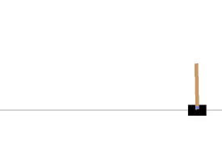
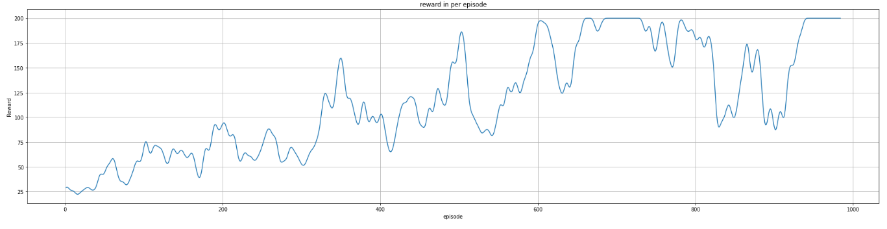

# Deep Reinforcement Learning for Cartpole Environment

In this project, we implement a policy gradient method using deep neural networks to train our agent in `cartpole` environment from the gym. For this implementation, we've used the Tensorflow framework.

## Environment
In `cartpole` Environment, our agent just has two actions to do:
- +1: push cart to the right
- 0: push cart to the left
our goal is to keep the balance of this cart.

## Training
we train our agent for 1000 episodes

## Results
Below is the average reward for training agent for 1000 episodes  
  

