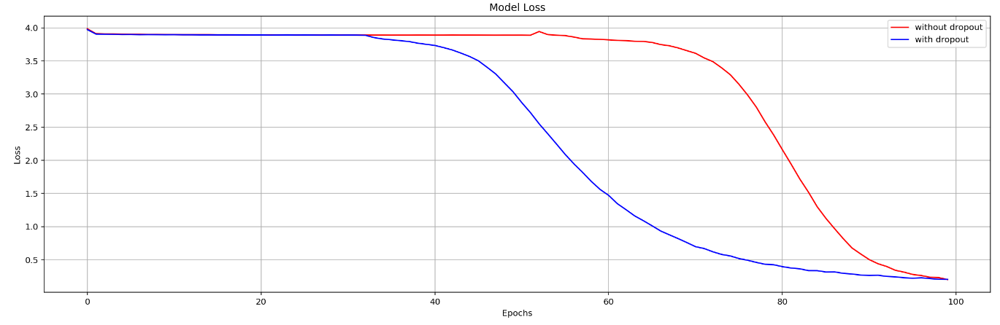

# Generating musics with LSTMs

## Dataset
We've used `MIDI Music Class` for generating musics using LSTMs. from various artists we've chosen melodies of Chopin Frédéric and Mozart.
several preprocessing steps have been done on the data before training:
- removing rare notes
- creating corpus of notes
- generating sequences
- considering the note after end of sequence as label
- one-hot encoding for labels

## Train
After doing preprocessing steps, We've used LSTMs to generate Music. For this purpose, we generate notes and after that we convert these generated notes to music with the help of `music21` python library.

Below is the loss function during training for a LSTM Network with dropout and without dropout

